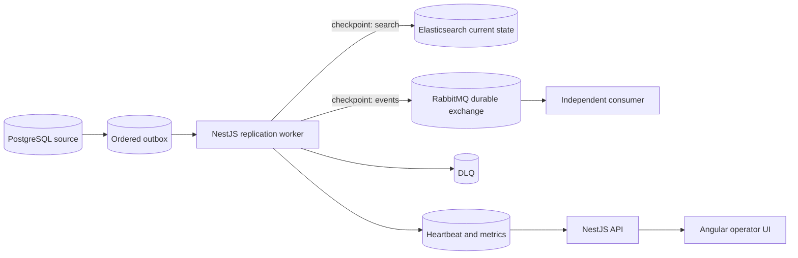

# Kill It Twice

Failure-oriented data replication demo for the Optio senior engineer assignment.

## Quick start

Prerequisites: Docker with Compose, Node 22+, pnpm 10+, and `curl`. PostgreSQL access is managed through Prisma for typed domain operations and explicit SQL for ordered outbox/checkpoint operations.

```bash
pnpm install
docker compose up --build -d
make seed
make verify
```

Open the operator console at <http://localhost:4200>. The API is available at <http://localhost:3000/api/status>; RabbitMQ management is at <http://localhost:15672> with `replication` / `replication`.

## Architecture



## Delivery guarantee

Transport is at-least-once. Final state is effectively-once: retries can repeat delivery attempts, but stable IDs, source revisions, per-sink checkpoints, Elasticsearch document IDs, durable RabbitMQ messages, and consumer deduplication make repeated effects harmless. Distributed exactly-once transactions are not claimed.

## Capacity notes

The default seed is 20,000 records, intentionally large enough to exercise bounded batches without making local verification impractical. The worker uses configurable 1–1,000-record reads and never loads the dataset into memory. Measure actual throughput with `make capacity`; the likely bottleneck is Elasticsearch indexing, followed by local PostgreSQL I/O. To double throughput, use Elasticsearch bulk requests, increase worker concurrency per sink, and partition the outbox by sequence range while retaining idempotent version checks.

Measured locally with `make capacity` on the Docker Compose stack: 20,000 records, batch size 100, 68.13 seconds end-to-end, 293.5 records/second, and 20,000 Elasticsearch documents. This is a reproducible baseline rather than a production capacity claim; host CPU, Docker resources, and storage will change the result.

## ADRs

### ADR-001: Ordered PostgreSQL outbox

Decision: represent source changes as a durable monotonic outbox. Alternatives were polling `updated_at` alone or using a broker as the source of truth. The outbox gives deterministic replay and avoids timestamp ties; the tradeoff is extra source writes and storage.

### ADR-002: Independent sink checkpoints

Decision: store one checkpoint per destination. A single global checkpoint would let an Elasticsearch outage incorrectly block or lose RabbitMQ progress. Independent checkpoints improve isolation but require separate reconciliation and observability.

### ADR-003: Effectively-once instead of distributed exactly-once

Decision: use at-least-once transport plus idempotency. A distributed transaction spanning PostgreSQL, Elasticsearch, and RabbitMQ would be complex and still dependent on external system guarantees. Idempotency makes the crash window safe while keeping the design understandable.

### ADR-004: Per-record DLQ handling

Decision: advance successful records and isolate permanent failures. Rolling back an entire batch would violate G4 and unnecessarily delay good records. The tradeoff is more detailed per-item bookkeeping.

### ADR-005: External source versions in Elasticsearch

Decision: send the source revision as Elasticsearch's external version with `external_gte`. A retry of the same revision is harmless, while an older event cannot overwrite a newer document. The tradeoff is that source versions must remain monotonic per record.

### ADR-006: RabbitMQ management health probe

Decision: have the API query RabbitMQ's authenticated management endpoint for status reporting. This gives operators a real dependency signal instead of a worker-owned placeholder; the tradeoff is one extra health request and the need to configure management credentials.

## What was not built and why

Authentication, multi-tenant isolation, production high availability, S3 archival, Redis caching, ClickHouse analytics, NiFi orchestration, and polished product UX were intentionally deferred. The assignment prioritizes failure behavior, verification, and operational clarity within the time limit.

## Where AI deviated from the specification

### Deviation 1 — The first crash test did not prove a mid-run kill

The initial AI-generated verifier seeded data and killed the worker immediately, then accepted any eventual completion. That was insufficient because the worker could finish before the kill. The verifier was corrected to pause the pipeline during seed, resume it, wait until the checkpoint is strictly between zero and the final sequence, and only then kill the worker.

### Deviation 2 — Reset logic ignored external sink state

The initial reset truncated PostgreSQL tables but left Elasticsearch documents and RabbitMQ messages untouched. G2 exposed this when Elasticsearch contained more documents than the new source dataset. The reset path now resets the custom PostgreSQL outbox sequence, while the verifier explicitly clears the Elasticsearch index and purges the consumer queue before each deterministic run.

### Deviation 3 — Retry logic was bounded but not actually backed off

The reliability rules in this spec require retries to be bounded and backed off. The AI-generated worker retry on a transient sink failure was a flat 1,000ms sleep on every attempt — bounded and logged, but not growing, so it satisfied the letter of "no busy-loop" without satisfying "backed off." Found in a self-review against the spec's own rules, not by a failing gate. Corrected to a per-sink exponential backoff (1s doubling to a 30s cap, reset on success), verified live in worker logs during a G3 outage (`attempt 1, retrying in 1000ms` → `attempt 2, retrying in 2000ms`).

### Deviation 4 — The independent consumer could retry a malformed message forever

The AI-generated RabbitMQ consumer treated every processing failure identically: `nack(message, false, true)`, unconditional requeue. That is correct for a transient database error, but a JSON parse failure on a malformed message body is deterministic — the same bytes fail identically forever, so requeueing is an unbounded retry loop with no way to succeed. No gate exercises this, since the worker never produces malformed JSON; found by reviewing the consumer against the same "bounded and backed off" rule that caught Deviation 3. Corrected by splitting the two failure classes: a parse failure is now routed once to a dedicated `replication.consumer.dlq` queue and acknowledged off the main queue, while a database-write failure still retries indefinitely with backoff, never acknowledged before success. Verified live by publishing a malformed message directly to the exchange and confirming it landed in the DLQ instead of looping.

### Deviation 5 — Elasticsearch deletes had no protection against stale-write resurrection

A delete was implemented as a hard `elastic.delete` call. That leaves no document behind for the external-version check (ADR-005) to compare against, so a later, out-of-order `upsert` event carrying an older version than the delete would find nothing to conflict with and would recreate the record — silently violating the same "older writes must not overwrite newer state" rule ADR-005 exists to enforce, just for deletes instead of updates. Found in a self-review, not by a gate; the current API has no endpoint that triggers a delete, so this was a latent path, not one any gate or the UI currently exercises. Corrected by writing a version-guarded tombstone document (`deleted: true`) instead of removing the document, and filtering tombstones out of `/api/replicated` search results.

## Gate status

The current live Docker run passes all required gates:

| Gate | Result | Evidence |
| --- | --- | --- |
| G1 resume after kill | PASS | Worker killed during backfill with incremental writes present; search checkpoint recovered to 5,025 |
| G2 no duplicates | PASS | Two worker kills; source 6,025; Elasticsearch 6,025; independent consumer unique count 6,025 |
| G3 sink outage | PASS | Elasticsearch container stopped with pending work, then restarted and drained |
| G4 partial batch failure | PASS | 497 valid records written; 3 invalid records isolated in the DLQ |
| G5 observability | PASS | Status exposes health, checkpoints, lag, throughput, and DLQ count |

The verifier also reports supplemental PASS checks for repeated restart recovery and corrected-source DLQ replay. Run `make verify` to repeat the failure-oriented integration test, or `make capacity` to repeat the 20,000-record measurement. The verifier intentionally reports FAIL rather than hiding an incomplete or unavailable dependency.
